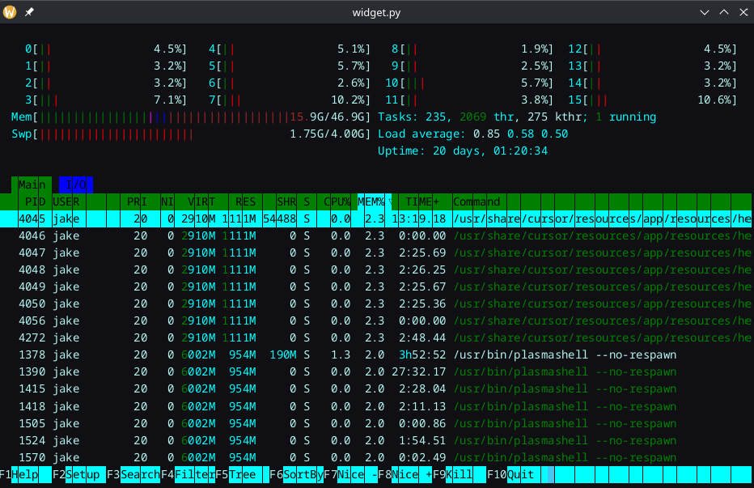
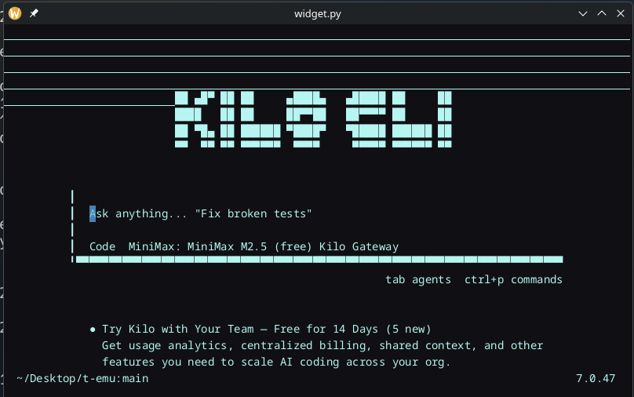

# Retroactive preface:
the journal guide just came out today so that's why so much time is getting skipped

as much as i've tried to like other terminal emulators, there's just been something missing from each one that put me off of it. most of it being that they all want big config files that you have to manually edit.

so my idea is kinda like; an actually good simple config gui in a terminal emulator that won't piss you off to use. a mix of normal app modernity with the utility of the terminal, in something that isn't trying to be entirely AI or something (warp terminal...)

i'm going to include an AI thing, but i'm writing it the right way imo, as in, fully out of the way unless you deliberately invoke it. not even a tooltip telling you "ctrl+whatever to ask AI" or something. and it can be fully disabled ENTIRELY. by entirely, i mean no toolips, no grayed out spots in the sidebar, no nothing. the only remnant will be the switch to turn it back on.

i'm not necessarily making this to appeal to the masses, moreso people like me, a power user, that is allowed to just do their thing, without losing the modern help that apps give you. i don't wanna spend an hour on a dotfile, i wanna do the thing i'm trying to do in a way that still feels like home for me.

that's kinda why i keep coming back to Konsole, it's not that compliated and it always works how I need it to, there's just things I'd like to add to it.

it's not gonna be perfect for everyone, that's the point.


# 20 Mar: getting there

so far today i've gotten resizing the terminal working. i mean, it worked before, but interactive apps didn't respond. now they're responsive so things like htop work well

i also got special keys working, so F-keys and key combos will work now.

i got a suggestion from someone on slack to add command completion. i think i'd just base it off ```history``` but not a bad idea. i'm not a big fan of command completion but it's easy enough to toggle on/off

i'm currently trying to get ctrl+c, and arrow keys working, but i'm having a hard time. i have work soon and can't work more today on the project, so total time about 1h 15m (hackatime). we'll figure it out tho :3

# 21 Mar: ironing out bugs

i figured out the ctrl+c issue. it's something to do with older programs that run the terminal in raw mode and don't have great support for interrupt (like htop, which uses F10 for quit instead of ctrl+c). it took a bit to figure out why my fixes wouldn't work, but I eventually figured it out. Implemented the fix!

I did notice that there's issues with colors and cells, especially in a color rich program like htop. 

i just had some bad math and fixed that one.

 i also noticed in htop that the blinking cursor doesn't stop like it should, and my arrow keys STILL aren't working.

i fixed the cursor thing, but now if i try to launch something like Kilo CLI/OpenCode it... crashes?

says: ```Traceback (most recent call last):
  File "/home/jake/Desktop/t-emu/widget.py", line 235, in _on_output
    self._emu.feed(data)
  File "/home/jake/Desktop/t-emu/emulator.py", line 10, in feed
    self._stream.feed(text)
  File "/home/jake/.pyenv/versions/3.11.6/lib/python3.11/site-packages/pyte/streams.py", line 205, in feed
    taking_plain_text = send(data[offset:offset + 1])
                        ^^^^^^^^^^^^^^^^^^^^^^^^^^^^^
  File "/home/jake/.pyenv/versions/3.11.6/lib/python3.11/site-packages/pyte/streams.py", line 213, in _send_to_parser
    return self._parser.send(data)
           ^^^^^^^^^^^^^^^^^^^^^^^
  File "/home/jake/.pyenv/versions/3.11.6/lib/python3.11/site-packages/pyte/streams.py", line 353, in _parser_fsm
    csi_dispatch[char](*params, private=True)
TypeError: Screen.report_device_status() got an unexpected keyword argument 'private'
[1]    3336387 segmentation fault (core dumped)  python3 widget.py```

guess I'll try to do that, because this is interesting. i'm calling this now, but my suspicion is that it has something to do with OpenCode being able to take mouse inputs and my program not handling it yet.

alright i got it to stop crashing. of course it turned out to be something completely different, my font handling. but now it just looks like shit. i don't know if i'm going to try and fix this yet or if i'll fix it later, but just look at this:



i think i'll be done for today. total time in hackatime; 1h 6m

23 Mar: more bugs and getting it a bit prettier

so i guess more complicated repls and interactive programs like OpenCode/Kilo CLI just have a hard time running and pyte's color stuff is confusing. i'm going to be honest, i had Claude figure out why the hell Kilo was looking the way it was. 

now the colors are right, but there's still those handful of lines at the top as seen in the previous photo, what could that be?

i guess at some point kilo sets the underline attribute during setup and pyte doesn't really like that. we just had to add a bit more restricting handling to not draw underlines in spaces that are empty but colored. so now it's all good.

27/28 Mar: getting back into it

I took a break for finals week, but it's time to start working again. On the 27th I implemented a slide out sidebar for settings config and then immediately went to go take a nap without committing it. Today, I wanna try and make it look a bit better, and add some rudimentary settings.

i added a slide out settings menu, and also a tab system for different menu sections. i really like the look of it, and i made sure it was responsive with programs, i'm really happy with how it turned out. eventually i might add a carousel look to the settings tabs, but that would probably be a pain in the ass in Qt and i wanna get more basic things working in the program right now.

i'll be done for the night, as it's 11pm. total time in hackatime; 57m.

1 Apr: tired but we still going

all this is kinda a bitch to do and i'm still debating on whether or not i am gonna go to the event (i prob will but its still up in the air). today i'm trying to just keep going, we're introducing some settings and starting work on the LLM modal thingy. I have a little sheet of paper for tracking what i've done because I keep sitting down and thinking "okay what should I actually do"


as you can see i've finished implementing some color settings (not all of them, but this is okay for now), and it's time to start working on LLM stuff. I think I'll just do the modal, not even having it actually work yet.


here, i've started on the llm modal, and tomorrow i will start on prettying it up. it's overlapping the current line rn, and i forgot to make hitting ctrl+k again close it, and i need to make the colors configurable, but that's all for tomorrow. i'm going to bed. total time in hackatime today: 1h, 47m.